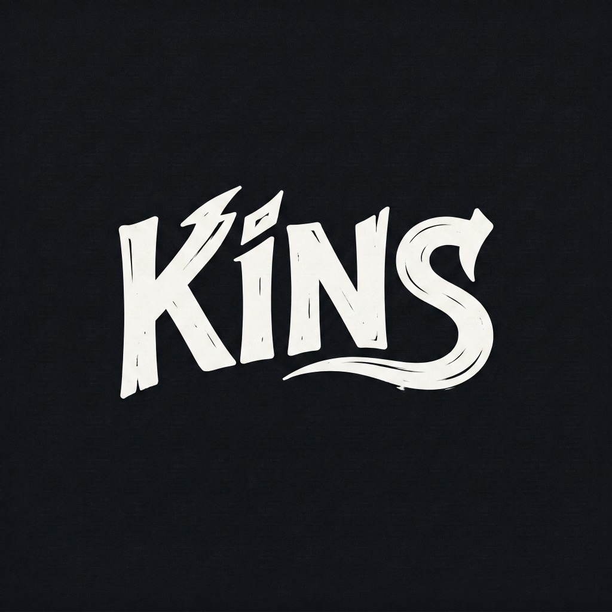

# 🎵 Kins Band - Official Hub

> 🌐 **Live Website**: [https://kinsband-hub.vercel.app](https://kinsband-hub.vercel.app)

---

A high-performance, mobile-first **direct-to-fan hub** for **Kins Band** — link-in-bio, live show portal, press kit and serverless fan-capture APIs in one Astro hybrid site.



---

## ✨ Features

- 🎧 **Interactive Audio Player**: Streaming track previews via an animated vinyl deck.
- 📅 **Live Gig Tracker & Map**: Upcoming/past shows with Leaflet map sheets, setlists and check-ins.
- 🎸 **Covers Search Overlay**: ⌘K searchable catalog of covered songs with video popups.
- 🔴 **Live Show Portal (`/live`)**: Master stream player, synced setlist/lyrics/TABs stage, fan wall, chat reactions and tip jar — enabled per-show via config.
- 🗞️ **Electronic Press Kit (`/epk`)**: Roster, repertoire, backline specs, contacts and download deck — gated by config until assets land.
- 🔧 **KINS Tuner (`/tuner`)**: Chromatic instrument tuner (guitar/bass) + drum reference tones. No app needed.
- 👥 **Band Members & Crew Spotlight**: Member bios plus community submission slots.
- 💡 **Inspiration Vault**: Per-member curated influences with iTunes-enriched artwork/previews.
- ✉️ **Subscribe & Fan Club Form**: Google One Tap + email capture → Supabase → Resend welcome → Discord roles.

---

## 🛠️ Built With

| Layer | Tech |
|---|---|
| Framework | [Astro 4](https://astro.build/) — `output: 'hybrid'` (static pages + server endpoints), zero UI framework |
| Hosting | Vercel serverless (`@astrojs/vercel`), Node 24 |
| Client JS | Vanilla ES module controllers (`src/scripts/controllers/`) |
| Server | TypeScript strict API routes (`src/pages/api/*`) + Supabase service-role client + Resend + Discord webhooks |
| Styling | Plain CSS design tokens (`src/styles/tokens/variables.css`) — neo-brutalist system |
| Icons | Font Awesome 6.5 (CDN, non-render-blocking) |

---

## 🚀 Local Development

### 1. Clone the repository
```bash
git clone https://github.com/KinsBand/kins-link-tree.git
cd kins-link-tree
```

### 2. Install dependencies
```bash
npm install
```

### 3. Run dev server
```bash
npm run dev
```
Open [http://localhost:4321/kins-link-tree/](http://localhost:4321/kins-link-tree/) in your browser.

> **Note:** PowerShell blocks `npm.ps1` — use `npm.cmd run build` on Windows.

---

## 📦 Build & Deployment

```bash
npm.cmd run build
```
Outputs to `.vercel/output/static` via the Vercel adapter. Deployment is managed through Vercel (connected repo). Feature flags for `/live`, `/epk`, merch etc. live in `src/settings/functionality.config.ts`.

© 2026 **Kins Band**. All rights reserved.
